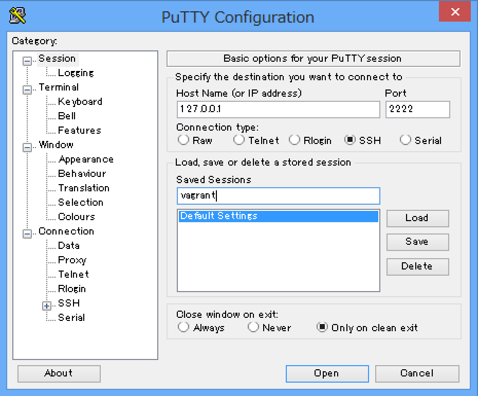
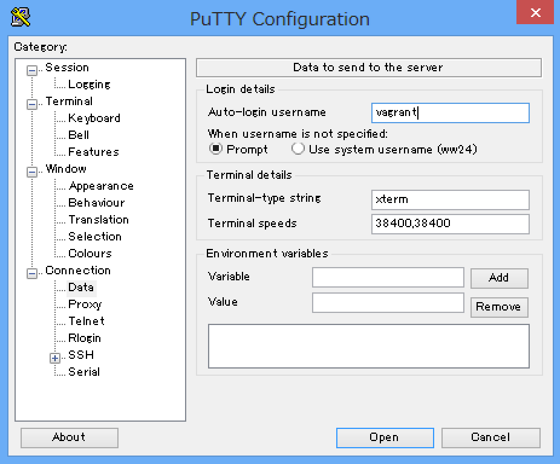

Densan Vagrant
==============
Ubuntu 15.04

北海道科学大学電子計算機研究部
サーバ構築学習用 Vagrantfile

Get Started
-----------
### VirtualBox, Vagrant の導入
まず、次の2つをインストールします。
* [VirtualBox](https://www.virtualbox.org/wiki/Downloads)
* [Vagrant](https://www.vagrantup.com/downloads.html)

### GitHub fork
このリポジトリを右上のボタンから Fork します。

### git clone
SourceTree を使ってリポジトリから clone します。

### vagrant の起動
Vagrantfile のあるディレクトリでコマンドプロンプト (`cmd`) を開いて次のコマンドを実行します。

```
vagrant up
```

### vagrant で起動した VM へ SSH 接続
次のコマンドで SSH 接続されるか、 SSH 接続に必要な情報が表示されます。

```
vagrant ssh
```

### SSH 接続
`vagrant ssh` コマンドで SSH 接続情報が表示された場合は、 PuTTY 等の SSH クライアントを使って接続します。

[PuTTY](http://www.chiark.greenend.org.uk/~sgtatham/putty/download.html)

PuTTY.exe をダウンロード後、起動します。



接続情報を入力して、 `vagrant` 等の分かりやすい名前をつけて session を保存します。

Open ボタンを押すと接続します。

### ユーザ名とパスワード
SSH 接続時に求められるユーザ名とパスワードは共に `vagrant` です。

PuTTY では次のように、ログイン時のユーザ名を固定できます。



### vagrant の停止
Vagrantfile のあるディレクトリで以下のコマンドを実行すると VM が停止します。

```
vagrant halt
```

### vagrant の状態確認
Vagrantfile のあるディレクトリで以下のコマンドを実行すると、 VM の状態が確認できます。

```
vagrant status
```
